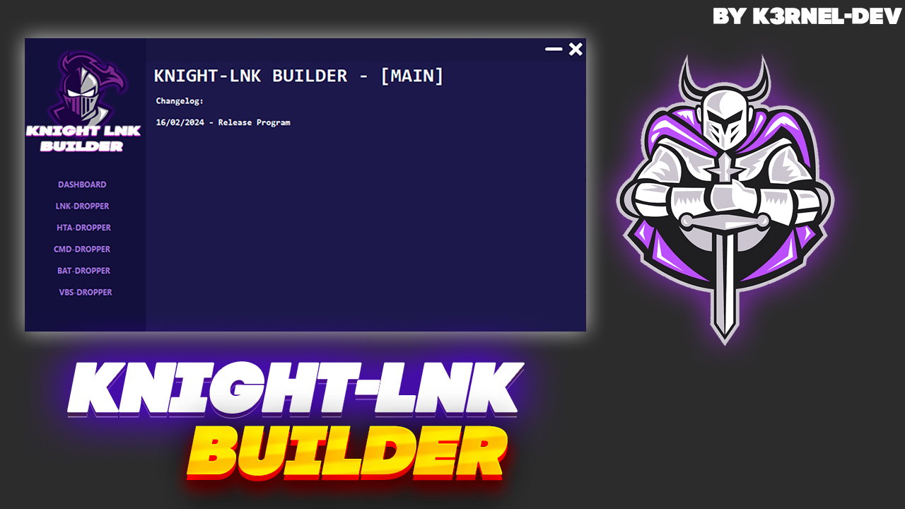
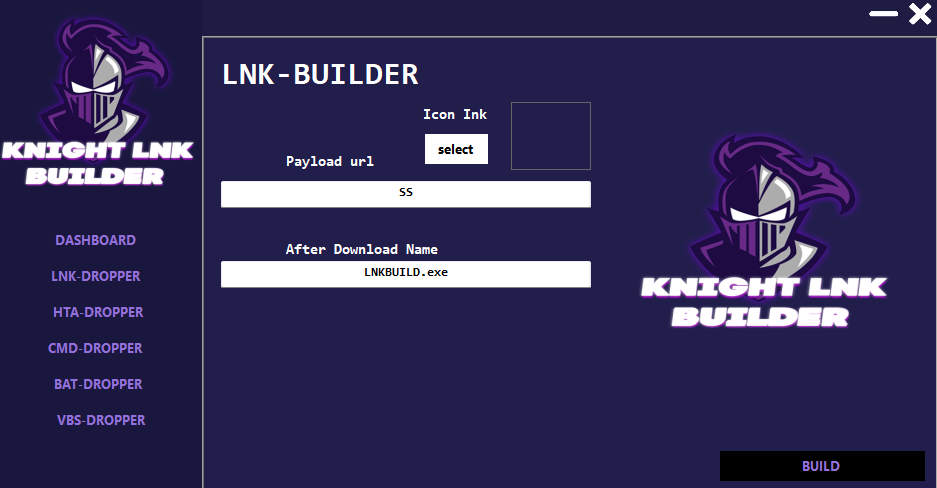
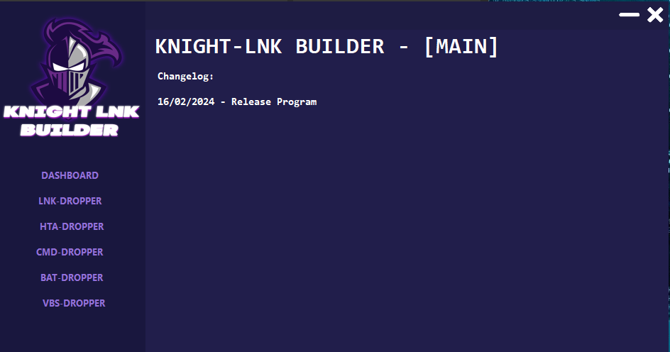

# KnightLNK_builder

## 📑 About
</b>(Knight-LNK BUILDER) Lnk-Dropper Builder on C# Language</b>
<strong> A simple builder for creating reference files to remote files with subsequent installation and hide launch.</strong>

## 💻 Screens

  
  

 

## 💻 Video
https://github.com/K3rnel-Dev/KnightLNK_builder/assets/132711888/9de22886-be81-4b72-b174-acb8fa52af99

## How to use?
 * Put your exe-link and build the DropperFile

## ⚠️ Disclaimer
 * This project for education and purposes only!
 * Do not use for illegal purposes onyl!.

## ✨ End
<strong>~ Thanks for watching ~</strong>
